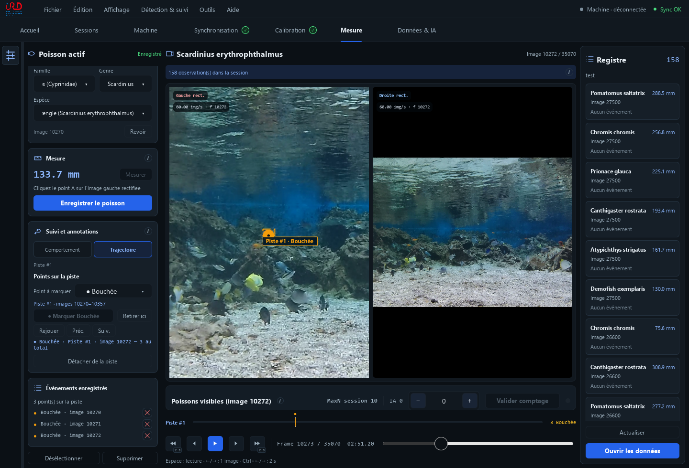

<p align="center">
  
</p>

<h1 align="center">AquaMeasure</h1>

<p align="center">Mesurer les poissons et annoter leurs comportements sur des vidéos stéréo.</p>

<p align="center">
  <a href="aquameasure-pyside/docs/MANUEL_UTILISATEUR.md">Manuel utilisateur</a> ·
  <a href="aquameasure-pyside/docs/DETECTEURS.md">Modèles IA</a> ·
  <a href="aquameasure-pyside/docs/GUIDE_DEVELOPPEUR.md">Guide du code</a>
</p>



*Capture de démonstration. Les mesures et les annotations illustrent les commandes.*

## Ce que fait l’application

| Étape | Dans AquaMeasure |
|---|---|
| Synchroniser | Aligner les vidéos gauche et droite par flash ou manuellement. |
| Calibrer | Calculer la géométrie des caméras avec une mire ChArUco, puis enregistrer la calibration. |
| Mesurer | Identifier un poisson, pointer ses extrémités et enregistrer sa longueur en millimètres. |
| Annoter et suivre | Marquer une action, délimiter un comportement ou suivre une trajectoire avec des points précis. |
| Exporter | Récupérer les mesures, comptages MaxN, pistes et événements en CSV, COCO ou COCO-VID. |
| Enrichir Fishial | Ajouter ses images validées à la bibliothèque locale et la transférer entre postes. |

**Comportement** décrit une action à un instant ou sur une durée.
**Trajectoire** suit le déplacement du poisson ; on peut ensuite y pointer des bouchées ou d’autres actions.

## Les manuels

| Document | Lire en ligne | PDF | Word |
|---|---|---|---|
| Utiliser AquaMeasure | [Ouvrir](aquameasure-pyside/docs/MANUEL_UTILISATEUR.md) | [Télécharger](aquameasure-pyside/docs/pdf/AquaMeasure_Manuel_Utilisateur.pdf) | [Télécharger](aquameasure-pyside/docs/word/AquaMeasure_Manuel_Utilisateur.docx) |
| Charger et mettre à jour les modèles IA | [Ouvrir](aquameasure-pyside/docs/DETECTEURS.md) | [Télécharger](aquameasure-pyside/docs/pdf/AquaMeasure_Guide_Extension_Modeles_Detection.pdf) | [Télécharger](aquameasure-pyside/docs/word/AquaMeasure_Guide_Extension_Modeles_Detection.docx) |

## Lancer depuis les sources

Sous Windows, avec Git et Python 3.11 installés :

```powershell
git clone https://github.com/sas-ldi/AquaMeasure-.git AquaMeasure
cd AquaMeasure
py -3.11 -m venv fish-vision/.venv
.\fish-vision\.venv\Scripts\python.exe -m pip install -r aquameasure-pyside/requirements.txt
.\fish-vision\.venv\Scripts\python.exe aquameasure-pyside/main.py
```

Pour la détection, ouvrir **Mesure → Réglages → Détection IA → Gérer les modèles**, puis télécharger un modèle ou importer ses poids. Fishial, Community Fish Detector et plusieurs moteurs YOLO sont pris en charge. SAM 3 demande un accès personnel aux poids Meta. Voir le [guide des modèles](aquameasure-pyside/docs/DETECTEURS.md).

Les modèles téléchargés fonctionnent localement. Les vidéos restent à leur emplacement ; le dossier des données se choisit dans les préférences.

Ce dépôt contient le code, les manuels et le référentiel taxonomique. Les exécutables, poids IA et données de session sont exclus. Les [instructions de compilation](aquameasure-pyside/docs/GUIDE_DEVELOPPEUR.md#produire-la-version-windows) permettent de construire sa propre application.

## Utilisation et recherche

Le code propre à AquaMeasure est mis à disposition pour un **usage non commercial**, notamment la recherche et l’enseignement. Une utilisation commerciale nécessite l’accord écrit des titulaires des droits. Voir la [licence AquaMeasure](LICENSE).

Les bibliothèques et modèles tiers gardent leurs licences, notamment l’AGPL d’Ultralytics. La licence AquaMeasure ne remplace pas leurs conditions ; la redistribution d’une application qui les intègre doit respecter ces conditions. Voir les [licences des composants](THIRD_PARTY_NOTICES.md).

Projet **ARMS Resilience**, IRD / UMR MARBEC. Pour citer le logiciel : [CITATION.cff](CITATION.cff). Pour signaler un problème : [Issues](https://github.com/sas-ldi/AquaMeasure-/issues).
