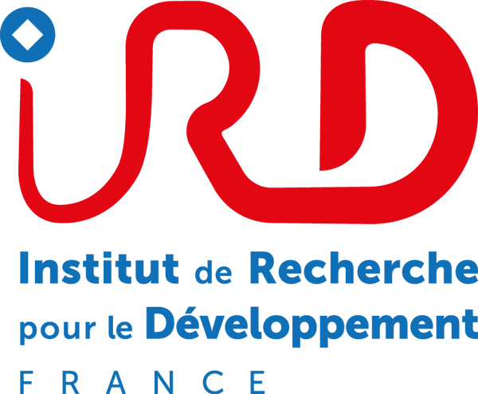

<p align="center">
  
</p>

<h1 align="center">AquaMeasure</h1>

<p align="center">Mesurer les poissons et annoter leurs comportements sur des vidéos stéréo.</p>

<p align="center">
  <a href="docs/MANUEL_UTILISATEUR.md">Manuel utilisateur</a> ·
  <a href="docs/DETECTEURS.md">Modèles IA</a> ·
  <a href="docs/GUIDE_DEVELOPPEUR.md">Guide du code</a>
</p>


*Capture de démonstration. Les mesures et les annotations illustrent les commandes.*

## Ce que fait l’application

| Étape | Dans AquaMeasure |
|---|---|
| Synchroniser | Aligner les vidéos gauche et droite par flash ou manuellement. |
| Calibrer | Calculer la géométrie des caméras avec une mire ChArUco, puis enregistrer la calibration. |
| Mesurer | Identifier un poisson, pointer ses extrémités et enregistrer sa longueur en millimètres. |
| Annoter et suivre | Marquer une action, délimiter un comportement ou suivre une trajectoire avec des points précis. |
| Exporter | Récupérer les mesures, comptages MaxN, pistes et événements en CSV, COCO ou COCO-VID. |
| Enrichir Fishial | Ajouter ses images validées à la bibliothèque locale et la transférer entre postes. |

**Comportement** décrit une action à un instant ou sur une durée.
**Trajectoire** suit le déplacement du poisson ; on peut ensuite y pointer des bouchées ou d’autres actions.

## Les manuels

| Guide | Thème | Word | PDF |
|---|---|---|---|
| [Manuel utilisateur](docs/MANUEL_UTILISATEUR.md) | Utilisation | [Télécharger](docs/word/01_Utilisation/AquaMeasure_Manuel_Utilisateur.docx) | [Lire](docs/pdf/01_Utilisation/AquaMeasure_Manuel_Utilisateur.pdf) |
| [Modèles IA](docs/DETECTEURS.md) | Utilisation | [Télécharger](docs/word/01_Utilisation/AquaMeasure_Guide_Extension_Modeles_Detection.docx) | [Lire](docs/pdf/01_Utilisation/AquaMeasure_Guide_Extension_Modeles_Detection.pdf) |
| [Calibration stéréo](docs/methodes/CALIBRATION_STEREO.md) | Calibration et mesure | [Télécharger](docs/word/02_Calibration_et_mesure/AquaMeasure_Note_Calibration_Stereo.docx) | [Lire](docs/pdf/02_Calibration_et_mesure/AquaMeasure_Note_Calibration_Stereo.pdf) |
| [Mesure stéréo](docs/methodes/MESURE_STEREO.md) | Calibration et mesure | [Télécharger](docs/word/02_Calibration_et_mesure/AquaMeasure_Note_Mesure_Stereo.docx) | [Lire](docs/pdf/02_Calibration_et_mesure/AquaMeasure_Note_Mesure_Stereo.pdf) |
| [Guide du code](docs/GUIDE_DEVELOPPEUR.md) | Code et données | [Télécharger](docs/word/03_Code_et_donnees/AquaMeasure_Guide_Developpeur.docx) | [Lire](docs/pdf/03_Code_et_donnees/AquaMeasure_Guide_Developpeur.pdf) |
| [Base de données](docs/technique/BASE_DE_DONNEES.md) | Code et données | [Télécharger](docs/word/03_Code_et_donnees/AquaMeasure_Note_Base_De_Donnees.docx) | [Lire](docs/pdf/03_Code_et_donnees/AquaMeasure_Note_Base_De_Donnees.pdf) |
| [Exports et jeux de données](docs/technique/EXPORTS_DATASETS.md) | Code et données | [Télécharger](docs/word/03_Code_et_donnees/AquaMeasure_Note_Exports_Datasets.docx) | [Lire](docs/pdf/03_Code_et_donnees/AquaMeasure_Note_Exports_Datasets.pdf) |
| [Évolutions de septembre 2026](docs/evolutions/EVOLUTIONS_2026_09.md) | Évolutions | [Télécharger](docs/word/04_Evolutions/AquaMeasure_Evolutions_2026_09.docx) | [Lire](docs/pdf/04_Evolutions/AquaMeasure_Evolutions_2026_09.pdf) |

Le [sommaire des documents](docs/README.md) précise le contenu de chaque guide.

## Organisation du dépôt

```text
src/         Application, calculs, annotations et modèles de détection
docs/        Manuels et notes avec leurs versions Word et PDF
tests/       Vérifications de l’interface et des données
scripts/     Lancement des contrôles et préparation des livraisons
packaging/   Compilation Windows et installateur
```

Les mires se génèrent dans la page Calibration, avec les dimensions du montage.

## Lancer depuis les sources

Sous Windows, avec Git et Python 3.11 installés :

```powershell
git clone https://github.com/sas-ldi/AquaMeasure-.git AquaMeasure
cd AquaMeasure
py -3.11 -m venv .venv
.\.venv\Scripts\python.exe -m pip install -r requirements.txt
.\.venv\Scripts\python.exe src/interface/main.py
```

Pour la détection, ouvrir **Mesure → Réglages → Détection IA → Gérer les modèles**, puis télécharger un modèle ou importer ses poids. Fishial, Community Fish Detector et plusieurs moteurs YOLO sont pris en charge. SAM 3 demande un accès personnel aux poids Meta. Voir le [guide des modèles](docs/DETECTEURS.md).

Les modèles téléchargés fonctionnent localement. Les vidéos restent à leur emplacement ; le dossier des données se choisit dans les préférences.

Ce dépôt contient le code, les manuels et le référentiel taxonomique. Les exécutables, poids IA et données de session sont exclus. Les [instructions de compilation](docs/GUIDE_DEVELOPPEUR.md#produire-la-version-windows) permettent de construire sa propre application.

## Utilisation et recherche

Le code propre à AquaMeasure est mis à disposition pour un **usage non commercial**, notamment la recherche et l’enseignement. Une utilisation commerciale nécessite l’accord écrit des titulaires des droits. Voir la [licence AquaMeasure](LICENSE).

Les bibliothèques et modèles tiers gardent leurs licences, notamment l’AGPL d’Ultralytics. La licence AquaMeasure ne remplace pas leurs conditions ; la redistribution d’une application qui les intègre doit respecter ces conditions. Voir les [licences des composants](THIRD_PARTY_NOTICES.md).

Projet **ARMS Resilience**, IRD / UMR MARBEC. Pour citer le logiciel : [CITATION.cff](CITATION.cff). Pour signaler un problème : [Issues](https://github.com/sas-ldi/AquaMeasure-/issues).
