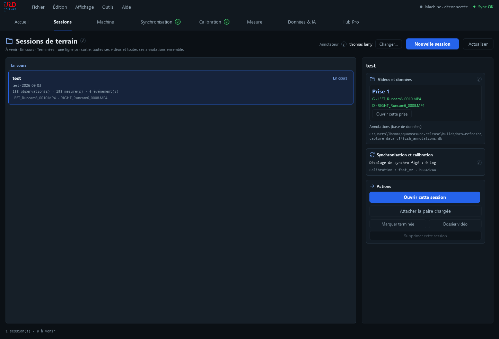
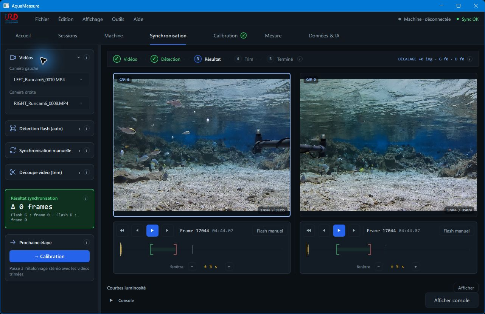
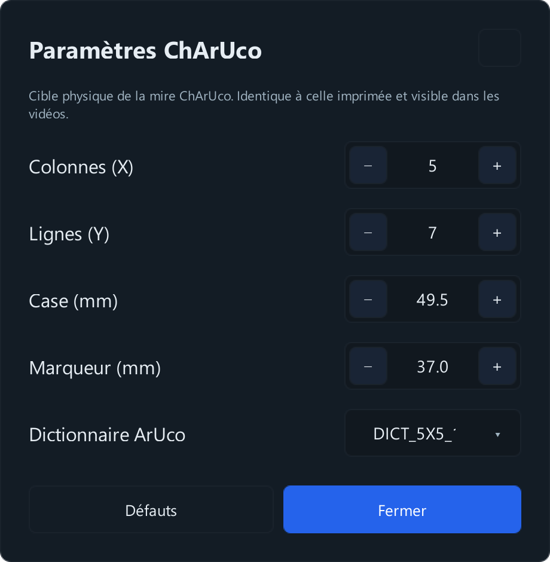
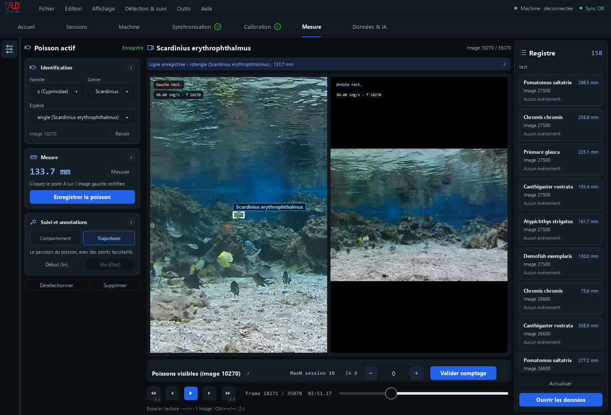
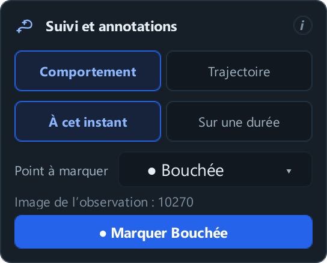
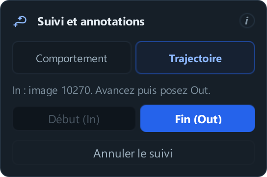
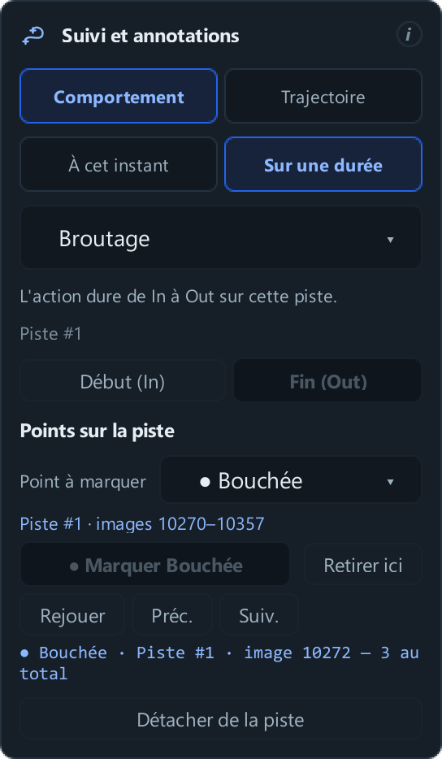
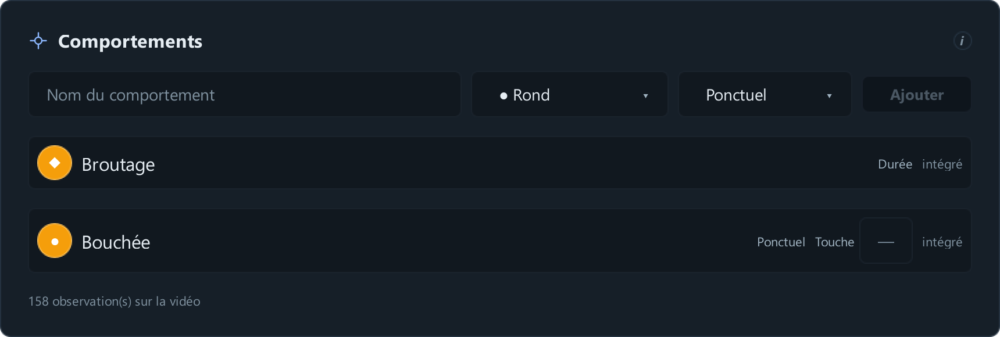
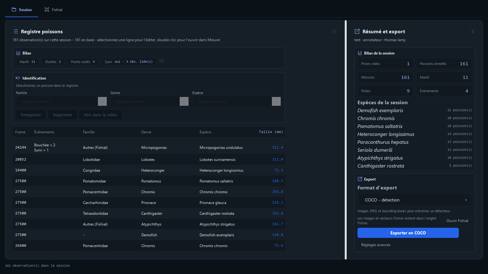

# AquaMeasure Manuel utilisateur

Ce manuel suit une séance de travail : préparer les vidéos, mesurer un poisson, le suivre et noter ce qu’il fait. Les captures montrent la version du 8 septembre 2026 avec une copie de la session de démonstration. Les longueurs, les espèces fictives et les marqueurs de cet exemple servent à montrer les commandes.

## Organiser une journée de travail

Une **session** regroupe les prises d’une sortie. Une **prise** contient une vidéo gauche et une vidéo droite : huit paires correspondent donc à huit prises et seize fichiers vidéo.

La calibration décrit le montage des caméras. Une calibration faite au début de la journée peut servir à toutes les prises, et même à plusieurs sessions, tant que le montage, les réglages optiques et les conditions d’immersion restent les mêmes. La synchronisation se vérifie pour chaque paire.

### Préparer la première prise

1. Branchez le disque contenant les vidéos. Dans **Sessions → Nouvelle session**, renseignez le lieu et la date, puis créez la session avant de charger sa première prise.
2. Faites la calibration avec les vidéos de mire, comme décrit plus loin. Si elle existe déjà, ouvrez **Calibration**, puis **Fichier → Importer une calibration…** et choisissez son ZIP. Si la bonne calibration est encore active, aucun import n’est nécessaire.
3. Après une nouvelle calibration, gardez-en un ZIP par **Fichier → Exporter la calibration…**, avec un nom reconnaissable, par exemple `calibration_recif_2026-09-08.zip`.
4. Dans **Synchronisation**, chargez et synchronisez les deux vidéos de poissons. Dans **Mesure → Réglages → Vidéos**, cliquez **Charger depuis Sync** et vérifiez **Calibration utilisée**.
5. Dans **Sessions**, sélectionnez la journée puis **Attacher la paire chargée**. Attendez l’apparition de **Prise 1**. Vous pouvez ensuite mesurer, identifier et suivre les poissons dans **Mesure**.

Importez la calibration avant de charger la nouvelle paire : le ZIP peut aussi contenir les chemins et la synchronisation des vidéos qui ont servi à la calibration.

### Ajouter les prises suivantes

Gardez la même session. Chargez la nouvelle paire dans **Synchronisation**, vérifiez son alignement, puis **Mesure → Réglages → Vidéos → Charger depuis Sync**. Revenez dans **Sessions** et cliquez **Attacher la paire chargée**. La nouvelle prise s’ajoute à la liste ; les précédentes restent enregistrées. Conservez la même calibration si le montage n’a pas changé.

### Reprendre une prise déjà traitée

Sélectionnez la session puis **Ouvrir cette session**, ou **Ouvrir cette prise** pour choisir une paire précise. Les fichiers originaux doivent être accessibles. Vérifiez l’alignement gauche/droite si vous avez travaillé sur une autre paire entre-temps.

La ligne **Calibration** dans la session garde une référence du calcul utilisé ; elle ne recharge pas automatiquement le ZIP. Si une autre calibration est devenue active, réimportez celle de cette session, puis vérifiez **Calibration utilisée** avant de mesurer à nouveau.

## Synchroniser les vidéos

Les images gauche et droite doivent montrer le même instant.

1. Dans **Synchronisation → Vidéos**, choisissez **Caméra gauche** et **Caméra droite**.
2. Placez chaque lecteur près du flash commun aux deux vidéos et cliquez **Flash manuel** sous chaque image pour y poser le repère de recherche.
3. Dans **Détection flash (auto)**, cliquez **Détecter flash**. Utilisez **Cadre de détection** si des reflets gênent la recherche.
4. Vérifiez les deux images retenues. Si elles ne correspondent pas, placez chaque lecteur sur le même instant puis utilisez **Synchronisation manuelle → Appliquer sync (frames courantes)**.
5. Pour limiter la partie utile, réglez les bornes dans **Découpe vidéo (trim)** et cliquez **Enregistrer In / Out**.

Les bornes de découpe concernent les vidéos. Les boutons In et Out du suivi, utilisés plus loin, concernent un poisson.

## Calibrer le montage

La calibration corrige les objectifs et donne l’échelle en millimètres. Utilisez les mêmes caméras, les mêmes réglages et le même montage que pour les poissons. Sous l’eau, calibrez dans les conditions d’immersion utilisées. Refaites la calibration si la position des caméras a changé.

1. Filmez une mire ChArUco nette dans les deux caméras, à plusieurs distances, positions et inclinaisons.
2. Synchronisez cette paire, puis ouvrez **Calibration**.
3. Dans **Mire ChArUco**, renseignez la planche imprimée : nombre de cases, taille d’une case, taille des marqueurs et dictionnaire. Mesurez une case à la règle.
4. Dans **Paramètres calibration**, commencez avec les réglages proposés, puis cliquez **Lancer la calibration**.
5. À la fin, contrôlez l’erreur stéréo, l’écartement calculé des caméras et l’alignement des images.
6. Mesurez un objet de longueur connue à la distance habituelle des poissons. Ce contrôle est nécessaire même si l’application indique une bonne calibration.

La calibration est enregistrée automatiquement sur le poste. Gardez aussi son ZIP avec les archives de la journée. Si les poissons sont dans d’autres fichiers, synchronisez ensuite leur paire. Dans **Mesure → Réglages → Vidéos**, utilisez **Charger depuis Sync** et vérifiez **Calibration utilisée**.

Dans les paramètres de calibration, **Rapide** convient pour commencer. Les réglages sont regroupés en **Recherche de la mire**, **Calcul stéréo** et **Montage des caméras** ; les petits boutons **i** expliquent chaque valeur.

## Choisir et mesurer un poisson

Dans **Mesure**, les commandes du **Poisson actif** sont à gauche des vidéos. Le **Registre**, à droite, permet de retrouver les fiches. La lecture est en bas. Le bouton **Réglages**, tout à gauche, ouvre le tiroir des paramètres.

1. Mettez en pause sur une image nette.
2. Dans **Réglages → Détection IA**, lancez la détection, puis faites un clic droit sur le cadre du poisson. S’il manque, tracez son cadre dans l’image gauche.
3. Vérifiez famille, genre et espèce. Corrigez la proposition de Fishial. Renseignez seulement les niveaux que vous pouvez identifier ; **NA** indique explicitement un niveau non identifiable.
4. Cliquez **Mesurer**. Vérifiez les extrémités A et B dans les deux vues et ajustez les points en suivant la consigne de la carte **Mesure**. Visez les mêmes points anatomiques à gauche et à droite ; le zoom aide.
5. Cliquez **Enregistrer le poisson**.

Un cadre mal ajusté se corrige avant la mesure : faites un **clic droit**, puis cliquez sur le **crayon** pour le déplacer ou tirer ses poignées. Cela fonctionne aussi sur les cadres de l’IA et conserve le nom proposé ou corrigé dans la fiche, sans relancer Fishial. Le bouton **×** retire le cadre. Après un redimensionnement, refaites la mesure avant d’enregistrer.

Le même bouton crée une fiche puis enregistre ses corrections. Pour modifier un poisson, sélectionnez sa fiche dans le registre avant de corriger son nom. La longueur est facultative ; il n’y a plus de validation d’identification séparée.

## Choisir entre comportement et trajectoire

Dans **Poisson actif → Suivi et annotations** :

| Ce que vous voulez noter | Choix |
|---|---|
| Une bouchée à une image précise, sans suivi | **Comportement → À cet instant** |
| Une période pendant laquelle le poisson broute | **Comportement → Sur une durée → Broutage** |
| Suivre le poisson et pointer plusieurs bouchées | **Trajectoire**, puis **Points sur la piste** |

**Broutage** décrit une période. **Bouchée** décrit un instant. Une même piste peut porter une période de broutage et plusieurs bouchées.

## Noter un point sans suivre le poisson

1. Sur l’image de l’action, sélectionnez le poisson et enregistrez sa fiche.
2. Choisissez **Comportement → À cet instant**, puis **Bouchée** dans **Point à marquer**.
3. Cliquez **Marquer Bouchée**. Le bouton devient **Retirer Bouchée** pour corriger une erreur.

Sans piste, le point appartient à l’image enregistrée. **Revenir à cette image** permet de la retrouver. Pour pointer plusieurs instants du même poisson, créez sa trajectoire.

## Suivre le déplacement du poisson

1. Sur l’image de départ, sélectionnez le poisson et enregistrez sa fiche.
2. Choisissez **Trajectoire**, puis **Début (In)**.
3. Avancez jusqu’à la dernière image souhaitée et cliquez **Fin (Out)**.
4. Attendez le calcul et vérifiez le poisson suivi. Si l’application indique qu’il est perdu, cliquez sur son bon cadre ou réencadrez-le pour continuer.

Pour un premier suivi, partez de l’image de la fiche : le poisson y est localisé. **Revoir** y revient ; l’application peut aussi y revenir à In si elle ne dispose plus d’un cadre courant. Il n’est pas nécessaire de mesurer le poisson pour le suivre.

La piste conserve l’identification enregistrée. **Annuler le suivi** abandonne le calcul engagé. **Détacher de la piste** retire le lien avec cette fiche ; l’application demande confirmation et conserve l’ancienne piste et ses événements.

## Noter une période de broutage

1. Sélectionnez la fiche du poisson.
2. Choisissez **Comportement → Sur une durée → Broutage**.
3. Posez **Début (In)** au début de l’action, puis **Fin (Out)** à sa fin.

Sans piste existante, ce geste suit le poisson et enregistre la période de broutage. Si le poisson possède déjà une piste, posez les deux bornes à l’intérieur de cette piste : la trajectoire et ses points sont conservés.

La période apparaît dans **Événements enregistrés**. La suppression de cette ligne retire cette durée.

## Ajouter les bouchées sur la piste et les revoir

**Commencez par créer la trajectoire du poisson : Trajectoire → Début (In) → Fin (Out), puis attendez la fin du suivi.** Vous pourrez ensuite pointer ses bouchées dans **Points sur la piste**. Une période de **Broutage** décrit une durée ; elle ne place pas automatiquement les bouchées.

1. Choisissez **Bouchée** dans **Point à marquer**.
2. Mettez en pause à l’instant précis.
3. Cliquez sur le **cadre pointillé du poisson**, sur **Marquer Bouchée**, ou utilisez le raccourci du type. Ces trois gestes posent le même point, immédiatement enregistré.
4. Avancez et recommencez. **Retirer ici** corrige le point courant.
5. Cliquez **Rejouer**. La trajectoire s’affiche et le symbole apparaît au passage sur les images marquées.

**Événements enregistrés** et la frise sous les vidéos permettent de retrouver les points. Choisir Bouchée prépare le prochain marqueur ; cela ne déclare pas une bouchée sur toute la durée. Les points des captures sont rapprochés pour illustrer les commandes.

## Ajouter un autre marqueur

Dans **Édition → Préférences → Comportements**, saisissez un nom, choisissez un symbole et la portée **Ponctuel** ou **Durée**, puis **Ajouter**. Pour « Passage de raie », choisissez Ponctuel si vous voulez un instant, Durée si vous voulez le début et la fin du passage.

**Bouchée** et **Broutage** sont présents par défaut. Pour affecter une lettre à un type ponctuel, saisissez-la dans **Touche**, puis appuyez sur **Entrée** ou cliquez ailleurs pour enregistrer et quitter le champ. **Maj + la lettre** retire le point sur piste. Aucun changement de code n’est nécessaire pour ajouter un type.

## Revoir et exporter la session

Dans **Données & IA → Session**, sélectionnez une ligne du registre pour la corriger ; un double-clic l’ouvre dans **Mesure**. Le panneau **Résumé et export**, à droite, contient le bilan. La liste des espèces défile au-dessus des commandes d’export, qui restent visibles en bas du panneau.

Choisissez **Format d’export**, puis le bouton d’export correspondant :

| Format | Contenu principal |
|---|---|
| **CSV - données de session** | Mesures, identifications, pistes, actions et comptages MaxN dans des tables reliées pour Excel. |
| **COCO - détection** | Images JPEG des observations exportées et cadres annotés, avec les catégories. |
| **COCO-VID - tracking** | Trajectoires, images JPEG et actions sur piste : frame de chaque point, début et fin de chaque durée. Copie MOTChallenge également fournie. |

Ces exports couvrent **toutes les prises attachées à la session**, même si une seule est ouverte à l’écran. Vous pouvez traiter les huit paires puis exporter une seule fois par format en fin de journée. Gardez le disque branché et la bonne calibration disponible jusqu’à la fin des exports. Si une vidéo a changé de chemin, utilisez **Retrouver la vidéo manquante…**. **Continuer avec les vidéos disponibles** produit un export partiel.

L'export **COCO-VID** inclut automatiquement les actions sur piste, y compris vos marqueurs personnalisés. Chaque bouchée garde sa frame exacte et le lien au poisson ; chaque période de broutage garde son début et sa fin.

Vous les trouverez dans `coco_vid.json` et `track_events.jsonl`, dans le dossier de suivi. Les lecteurs externes doivent prendre en charge ces champs AquaMeasure pour exploiter les actions.

Le dossier COCO ou COCO-VID contient les images exportées : il reste utilisable sans le disque des vidéos originales. Une image de marqueur absente des positions suivies est copiée à part dans `event_images`. Le paquet ne contient pas les vidéos complètes ni tous les instants intermédiaires. Conservez la sauvegarde de la base pour reprendre votre travail dans l'application, ainsi que les mesures dans le CSV.

### Exploiter les CSV dans Excel

Le même bouton produit `session.csv` pour les observations et leurs mesures, `evenements.csv` pour les bouchées et autres actions, `comptages.csv` pour les comptages IA et manuels. `pistes.csv` et `positions_pistes.csv` conservent le suivi. `videos.csv` et `resume_session.csv` décrivent les prises et la session. Le fichier `dictionnaire.csv` explique les colonnes et leurs unités. Ces données restent exportables si les vidéos sont débranchées.

Dans Excel, utilisez **Données → À partir d'un fichier texte/CSV**, avec UTF-8 et le séparateur virgule. Les décimales utilisent un point ; si nécessaire, choisissez une locale anglaise pour convertir les colonnes numériques. Les identifiants restent du texte. Une cellule vide signifie que la donnée manque ; un zéro est conservé.

Chaque action occupe une seule ligne, même si le poisson a plusieurs mesures. Reliez les tables avec `track_id`, `annotation_id` et `media_id`. **MaxN** reprend uniquement les comptages validés et reste vide sans validation. Ne l'additionnez pas entre les lignes. Le nombre de fiches et le nombre d'animaux distincts sont différents : `fish_key` regroupe les fiches d'une même piste, sans reconnaître un animal entre deux pistes ou deux vidéos.

### Terminer la journée et passer à la suivante

1. Vérifiez les identifications et les mesures. Dans **Résumé et export**, contrôlez le nombre de prises, puis exportez successivement **CSV**, **COCO** et, si vous avez des pistes, **COCO-VID**.
2. Après chaque export, cliquez **Ouvrir le dossier**. Vérifiez le bilan `session.json` et l’absence de vidéos ignorées ; conservez le dossier entier avec ses images et ses annotations.
3. Dans **Données & IA → Fishial**, cliquez **Ajouter toutes les nouvelles images** et attendez le bilan. Ce bouton réunit les sessions locales et respecte le seuil par espèce. Les espèces sous le seuil restent en attente. **Exporter les images Fishial** crée séparément le dossier de clichés recadrés et leur manifeste.
4. Dans **Édition → Préférences → Sauvegarde**, cliquez **Sauvegarder maintenant**. Conservez aussi la calibration, les images Fishial locales et les vidéos originales dans votre archive. Copiez les exports à l’endroit où vous voulez les utiliser.
5. Dans **Sessions**, cliquez **Marquer terminée**. Ce bouton classe la session ; il ne lance aucun export. Quittez l’application avant de débrancher le disque. Le lendemain, créez une **Nouvelle session** et reprenez le parcours de la première prise.

Une session terminée reste consultable. Pour exploiter les jeux COCO déjà produits, les vidéos originales ne sont plus nécessaires ; pour reprendre les mesures, revoir les séquences ou ajouter des annotations, il faut retrouver les vidéos et la calibration.

### Retrouver son Fishial local sur un autre PC

1. Sur le premier PC, ouvrez **Données & IA → Fishial**. Cliquez **Ajouter toutes les nouvelles images** et attendez le bilan.
2. Dans **Passer sur un autre PC**, cliquez **Exporter mon Fishial local**, puis **Ouvrir le dossier**. Copiez **Fishial_local.zip**.
3. Sur l’autre PC, ouvrez **Données & IA → Fishial → Importer un Fishial local** et choisissez ce ZIP.

Les références déjà calculées de toutes les sessions sont réunies, avec les espèces et les clichés disponibles. Elles complètent celles du PC destinataire ; réimporter le même ZIP ne les double pas. Vous pouvez continuer à ajouter de nouvelles observations ensuite. Le même modèle Fishial doit être installé sur les deux postes. Les vidéos ne sont pas nécessaires pour ce transfert.

**Exporter les images Fishial** garde son autre usage : récupérer les clichés classés par espèce. Pour transférer la reconnaissance locale, utilisez **Exporter mon Fishial local**.

## Sauvegarder et résoudre les blocages courants

Dans **Édition → Préférences**, vérifiez le dossier de données et utilisez les commandes de sauvegarde. Conservez aussi les vidéos originales et la calibration : un export de résultats ne suffit pas à reprendre tout le travail.

| Problème | Geste utile |
|---|---|
| Aucun poisson détecté | Vérifier le modèle et le seuil dans Détection IA, ou tracer un cadre. |
| Nom incorrect | Sélectionner la fiche, corriger le nom et Enregistrer le poisson. |
| Longueur absente ou incohérente | Contrôler synchronisation, calibration et points A/B dans les deux caméras. |
| In ou le point ne se pose pas | Vérifier la fiche sélectionnée ; revenir sur son image ou sur une image de sa piste. |
| Mauvais poisson pendant le suivi | Corriger le cadre lorsque le suivi s’arrête ; contrôler les croisements à la relecture. |
