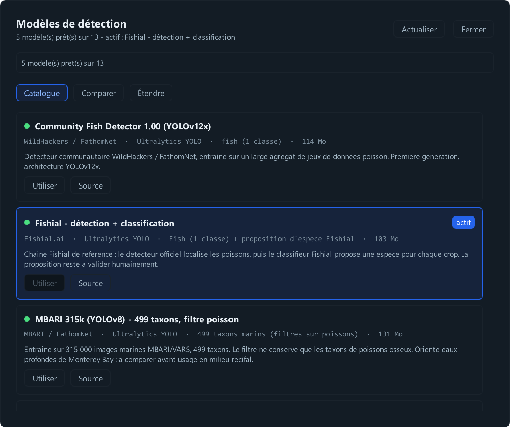
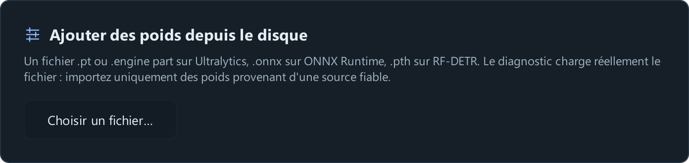
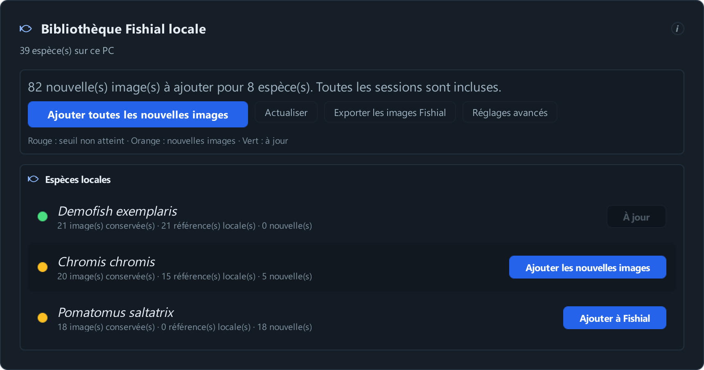
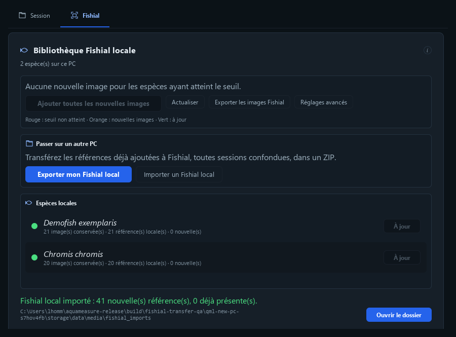

# AquaMeasure Ajouter et mettre à jour les modèles

Ce guide sert à charger des poids, changer de détecteur et enrichir la bibliothèque Fishial. Les captures montrent la version du 8 septembre 2026. Pour mesurer et suivre un poisson, voir le Manuel utilisateur.

## Ouvrir le gestionnaire

Dans **Mesure → Réglages → Détection IA**, ouvrez **Gérer les modèles**. Le gestionnaire propose le catalogue, une comparaison sur l'image courante et l'onglet **Étendre**.

Un modèle prêt possède des poids accessibles et un moteur installé. Le diagnostic charge le modèle et teste une inférence. Choisir ensuite Utiliser pour l'activer. Un modèle ajouté au catalogue n'est pas nécessairement compatible tant que le diagnostic n'a pas réussi.



## Installation depuis les sources GitHub

Les poids ne sont pas fournis dans le dépôt. Le gestionnaire télécharge les détecteurs et peut installer les moteurs manquants dans l’environnement Python de l’application.

Pour ajouter la **classification Fishial**, fermer l’application puis lancer cette commande depuis la racine du dépôt, après l’installation décrite dans le [README](../README.md) :

```powershell
.\.venv\Scripts\python.exe src/annotations/scripts/download_fishial.py --pack classification
```

Les fichiers vont dans `src/annotations/models`. Relancer l’application, puis télécharger et activer le détecteur Fishial dans le gestionnaire. Les packs fournis avec un installateur et ceux d’une installation depuis les sources peuvent donc être différents.

Les conditions de chaque moteur et de ses poids sont indiquées dans les [licences des composants](../THIRD_PARTY_NOTICES.md).

## Ajouter des poids YOLO

1. Copier le fichier de poids dans un dossier stable.
2. Ouvrir Étendre puis le sélecteur de fichier de poids.
3. Choisir le fichier. Son nom sert de libellé dans le catalogue local.
4. Attendre le diagnostic et lire l'architecture, les classes et le résultat du test.
5. Activer le modèle puis vérifier quelques images représentatives.



L'import référence le chemin du fichier. Il ne faut donc pas supprimer le fichier après l'ajout. Pour conserver deux versions comparables, leur donner des noms différents, par exemple recif_v1.pt et recif_v2.pt. Un même nom de fichier conduit au même identifiant local.

Pour remplacer une version existante, fermer les calculs en cours, remplacer le fichier et redémarrer l'application pour vider les modèles déjà chargés en mémoire. Conserver une copie de l'ancien poids et noter la date du changement.

## Ce qui détermine la compatibilité

| Fichier | Traitement dans AquaMeasure |
|---|---|
| .pt Ultralytics compatible | Import direct, diagnostic puis activation. |
| .onnx | Moteur ONNX ; le format des sorties doit correspondre au backend. |
| .pth RF-DETR | Moteur RF-DETR, avec variante reconnue ou précisée dans le catalogue. |
| .pt YOLOv5 historique | Entrée de catalogue avec backend yolov5 ; pas l'import .pt générique. |
| Nouvelle architecture | Mise à jour du moteur ou ajout d'un backend et de ses dépendances. |
| .engine TensorRT | Nécessite un environnement compatible ; la distribution CPU n'embarque pas TensorRT. |

Il n'existe pas de règle fiable « tout après v5 s'importe, tout avant v5 demande du code ». Les poids YOLOv5 historiques utilisent un autre chargement que les poids Ultralytics modernes. Un fichier plus récent peut aussi nécessiter une version plus récente d'Ultralytics ou une couche spécifique.

Pour un ancien .pt, ajouter une entrée JSON avec backend yolov5, comme MegaFishDetector. Renommer son extension ne convertit pas le modèle. Voir la [compatibilité YOLOv5](https://docs.ultralytics.com/models/yolov5/).

## Community Fish Detector

La distribution complète fournit CFD YOLOv12x et les variantes RF-DETR nano, small et medium du catalogue. Choisir l'entrée souhaitée puis comparer sur les mêmes images.

Les versions YOLOv12x utilisent Ultralytics. Les versions RF-DETR utilisent le moteur RF-DETR : elles ne sont pas interchangeables avec un poids YOLO. Pour une nouvelle publication, conserver son URL, son architecture, sa variante, sa résolution et son empreinte.

Si l'équipe publie un catalogue mis à jour, renseigner son URL dans Étendre, Catalogue distant, puis Mettre à jour. Télécharger les nouveaux poids lorsqu'ils sont proposés. Cette opération met à jour le catalogue et les ressources ; elle ne met pas à jour les bibliothèques Python de l'exécutable.

Source : [dépôt Community Fish Detector](https://github.com/filippovarini/community-fish-detector).

## SAM 3

AquaMeasure utilise SAM 3 pour détecter avec une consigne texte, par exemple fish ou underwater fish. Cette intégration produit des boîtes ; elle ne remplace pas le suivi ByteTrack par le tracker vidéo natif de SAM 3.

Le moteur Transformers est inclus dans la distribution complète. Les poids facebook/sam3 sont soumis à accès sur Hugging Face :

1. Ouvrir la page du modèle avec votre compte et obtenir l'accès demandé.
2. Créer un jeton de lecture autorisé pour ce dépôt.
3. Dans le gestionnaire, Étendre, utiliser le formulaire Hugging Face et enregistrer le jeton sur votre poste.
4. Choisir SAM 3 et lancer le premier test. Les poids sont téléchargés dans le cache Hugging Face.
5. Modifier ensuite le prompt si nécessaire ; les mêmes poids sont réutilisés.

Le téléchargement nécessite une connexion. Une fois les fichiers en cache, les usages suivants les réutilisent. Le temps de calcul peut être élevé sur CPU. Le paquet Windows livré est CPU ; pour une station GPU, préparer un environnement compatible et le tester séparément.

Ne pas diffuser un jeton personnel dans le catalogue ou l'installeur. Une mise à jour de la bibliothèque Transformers demande une nouvelle distribution ; un changement de dépôt peut se déclarer dans options.hf_model_id si le modèle conserve une architecture prise en charge.

Sources : [SAM 3 dans Transformers](https://huggingface.co/docs/transformers/model_doc/sam3) et [poids officiels facebook/sam3](https://huggingface.co/facebook/sam3).

## Ajouter une entrée de catalogue

Cette partie concerne les réglages techniques. Pour un fichier compatible, l'import depuis **Étendre** suffit.

Le fichier detectors.local.json se trouve dans camera_parameters de la racine de données utilisée. Exemple de structure :

```json
{
  "detectors": [
    {
      "id": "recif-yolo-v2",
      "label": "Récif version 2",
      "backend": "ultralytics",
      "bundled_paths": ["D:/Modeles/recif_v2.pt"],
      "imgsz": 1024,
      "default_conf": 0.4
    }
  ]
}
```

Pour YOLOv5 historique, remplacer backend par yolov5. Pour RF-DETR, utiliser rfdetr et préciser au besoin options.variant avec nano, small ou medium. Les chemins absolus sont pratiques pour un poste ; un catalogue partagé utilise plutôt des URL et noms de fichiers.

Une entrée téléchargeable ajoute download_url, filename et sha256. Le champ fish_classes permet de limiter les classes conservées d'un modèle multiclasse. Déclarer explicitement ces classes selon le modèle, sans reprendre une liste d'une autre version.

Ordre de priorité : catalogue livré, catalogue distant, catalogue local. Une entrée locale du même identifiant masque donc celle du catalogue distant.

## Ajouter une architecture

Dans la version source, créer une sous-classe de DetectorBackend dans src/plugins/detectors. Elle doit charger son modèle et renvoyer des boîtes au contrat commun. Un exemple inactif est fourni dans ce dossier.

Le plugin ne fournit pas automatiquement les bibliothèques dont il dépend. Pour un exécutable Windows, le développeur doit inclure ces bibliothèques dans le packaging et reconstruire l'application. Les utilisateurs continuent ensuite à importer les poids compatibles sans modifier le code.

## Retrouver les fichiers

Les poids sont cherchés dans AQUAMEASURE_MODELS_DIR si défini, dans le dossier models de la racine de données configurée, puis dans les emplacements de l'application. Le gestionnaire indique le chemin utilisé. Dans le dépôt source, les poids locaux se placent dans src/annotations/models ; une application installée les range avec ses ressources.

Les préférences de modèle et les catalogues locaux sont dans camera_parameters. Les poids et le jeton SAM 3 suivent les emplacements du cache Hugging Face. Un déplacement de vidéos n'entraîne pas un déplacement de modèles.

La liste exacte de la distribution est dans models-manifest.json. Les modèles maison issus d'un entraînement utilisateur et les poids SAM 3 soumis à accès personnel ne sont pas remplacés par le paquet.

## Ajouter une espèce à Fishial

Le détecteur trouve les cadres. Fishial propose un nom pour chaque poisson. Vous pouvez compléter sa bibliothèque locale avec vos images, sans réentraîner le modèle.

1. Dans **Mesure**, ouvrez la fiche d'un poisson et renseignez famille, genre et espèce. Pour une nouvelle espèce, saisissez son nom scientifique sous la forme **Genre espèce**, puis **Enregistrer le poisson**.
2. Enregistrez plusieurs exemples nets de cette espèce, avec des cadres corrects et des vues variées. La bibliothèque utilise les images recadrées des observations validées.
3. Ouvrez **Données & IA → Fishial**, puis **Actualiser**. Par défaut, il faut au moins cinq images ; ce seuil se règle dans **Réglages avancés**.
4. Quand la ligne est orange, cliquez **Ajouter à Fishial**. Si cette espèce possède déjà des références locales, le bouton s'appelle **Ajouter les nouvelles images**. Il affiche **À jour** quand il ne reste rien à ajouter.
5. Relancez une détection sur d'autres images pour vérifier les propositions. Corrigez les noms comme d'habitude dans la fiche du poisson.



Chaque image fournit une référence numérique, appelée vecteur. Toutes les sessions de la même base locale contribuent à cette bibliothèque, y compris pour une espèce déjà connue de Fishial. Les poids du modèle restent inchangés ; rien n'est publié sur le service Fishial en ligne.

**Ajouter toutes les nouvelles images**, en haut de la liste, traite les espèces ayant atteint le seuil réglé. Les anciennes références sont conservées : avec 20 références puis 40 nouvelles images validées, seules les 40 nouvelles sont calculées. Les espèces sous le seuil restent en attente.

Dans la démonstration, **Demofish exemplaris** possède 21 références. Ce nom et ses attributions sont fictifs : ils montrent le parcours, mais ne doivent pas servir à une identification scientifique.

## Exporter les images Fishial

Dans **Données & IA → Fishial**, cliquez **Exporter les images Fishial**, puis **Ouvrir le dossier**. L'export contient les images recadrées et leur manifeste avec les espèces associées, toutes sessions locales confondues.

Ce dossier sert à examiner ou partager les exemples. Pour réutiliser les références calculées sur un autre PC, utilisez le transfert ci-dessous.

## Transférer son Fishial local sur un autre PC

1. Sur le poste d’origine, cliquez **Ajouter toutes les nouvelles images** et attendez le bilan.
2. Dans **Passer sur un autre PC**, cliquez **Exporter mon Fishial local**, puis **Ouvrir le dossier**. Copiez **Fishial_local.zip** sur l’autre poste.
3. Sur le poste destinataire, cliquez **Importer un Fishial local** et choisissez le ZIP.



Le ZIP rassemble les références numériques déjà ajoutées à Fishial, leurs espèces et les clichés disponibles. Toutes les sessions locales et les références importées précédemment sont incluses. Le modèle Fishial de base doit être identique sur les deux postes ; l’application vérifie cette compatibilité avant l’import.

Les références existantes sont conservées. Un deuxième import du même ZIP n’ajoute aucun doublon. Si un même identifiant porte une correction différente, celle du poste destinataire est conservée et le bilan le signale. Les nouvelles observations peuvent ensuite enrichir les espèces importées comme les autres.

La bibliothèque fonctionne sans les vidéos d’origine et sans créer de poissons dans le registre. Les poids officiels restent ceux installés avec l’application. Le seuil minimum de références reste celui du poste destinataire, dans **Réglages avancés**.
